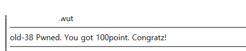

# Week_5) Wargame Write-up

이미 50점 문제와 100점짜리 문제 4개는 웹해킹스터디에서 풀어둔지라 그것은 상위디렉터리의 웹해킹 스터디쪽에 정리해둔 것으로 대체하고자 합니다. 

### 1. XSS-game 38번

이 문제도 상당히 억울하였다. 썼는데!!! 썼는데 왜!!!!

##### 1)  문제 파악

문제에 들어가면 단순한 로그인 폼이 존재한다. 이거로는 아무것도 할 수 없으니 일단 소스코드를 확인해보자.

admin.php라는 하위 디렉터리가 존재하는 모양이다. URL에 입력해서 가보면.......

로그인 폼에 입력된 데이터를 로깅하는 페이지와 admin으로 로깅되라는 문장이 나온다.

##### 2) 문제 풀이

admin이 되면 되니 로그인 폼에 admin을 입력하여본다.

어림도 없다.

아무거나 막 입력하여보니, escaping도 다 하는 것이 눈에 보인다.

줄바꿈을 해보기 위해 온갖 노력을 한 흔적이 보이는 와중에 하나가 보일 것이다.

 HTML escaping 이용해서 admin 했는데!! 왜 ㅠㅠㅠㅠ

이렇게 풀지 말라는 의도일 것이다.

하여튼 화나고 억울해서 결국 구글링의 도움을 받았더니, 방법은 정말로, 정말로 간단하였다.

로그인 폼을 textarea로 바꾸면 되는 것이었다.

##### 3) 결과

그렇게 textarea로 바꾸어 입력하면 점수를 주면서 로그를 날려버린다.

아.... 화난다.

***

### 1. XSS-game 26번

사실 이 문제도 URL Encoding까지 갔다가 2번 인코딩할 생각을 못해서 넘겼던 문제이다.

##### 1)  문제 파악

 	

문제에 들어가면 아무것도 없다. 역시 이거로는 아무것도 할 수 없으니 소스코드를 확인해보자.

정규식으로 막았으니 검증을 뚫을 방법은 거의 없어보인다. 

##### 2) 문제 풀이

일단 id값에 admin을 넣어보니, 당연하게도 안뚫린다. 다른 방법을 사용해야 할 것이다.

사실 URL 인코딩 이전 썼던 2가지 방법은 먼저, %00을 입력해서urldecode를 통과하면 admin만 남도록 하는 방법이었다. 정규식은 ad%00min에서 %00때문에 admin을 인식하지 못할 터이니. 그런데 배열 길이 때문인지, 결국에는 통과되지 않았다.

두번째는, php의 ==를 이용한 비교를 이용하려고 하였으나, Magic hash 취약점을 사용하기엔 문제점이 너무나 많았고, 뚫을 방법도 없었다.

결국 착안한 방법이 코드의 urldecode를 이용한 것이었는데, 1번만 인코딩했지, 2번만 인코딩할 생각은 못했다.

결국 인터넷에 찾아보고, 황당할 정도로 간단한 답에 망연자실했다.

##### 3) 결과

그렇게 2번 인코딩하니, 간단하게 답이 나왔다.

하......

이번 워게임에선 풀기 직전까지 갔다가 실패한 문제가 너무 많은 듯 하다. 물론, 이러한 경험으로 내공을 쌓아간다고 자기합리화중이긴 하다.

***

