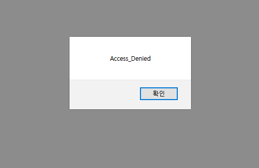

# Week_3) Wargame Write-up


### 1. root-me : javascript- source

이 문제는 자바 소스가 HTML 소스에 포함되어있다는 것을 알면 쉬운 문제이다.

##### 1) 문제 파악


- prompt를 통해서 PW를 받고 있다.


```html
<html>
    <head>
	<script type="text/javascript">
	/* <![CDATA[ */
	    function login(){
		pass=prompt("Entrez le mot de passe / Enter password");
		if ( pass == "123456azerty" ) {
		    alert("Mot de passe accepté, vous pouvez valider le challenge avec ce mot de passe.\nYou can validate the challenge using this password.");  }
		else {
		    alert("Mauvais mot de passe / wrong password !");
		}
	    }
	/* ]]> */
	</script>
    </head>
   <body onload="login();"><link rel='stylesheet' property='stylesheet' id='s' type='text/css' href='/template/s.css' media='all' /><iframe id='iframe' src='https://www.root-me.org/?page=externe_header'></iframe>

    </body>
</html>

```


- HTML 코드 


##### 2) 문제 풀이


```html
<html>
    <head>
	<script type="text/javascript">
	    function login(){
		pass=prompt("Entrez le mot de passe / Enter password");
		if ( pass == "123456azerty" ) 
        /*	여기 적나라하게 드러나있는 PW가 보이는가? */
        {
		    alert("Mot de passe accepté, vous pouvez valider le challenge avec ce mot de passe.\nYou can validate the challenge using this password.");  }
		else {
		    alert("Mauvais mot de passe / wrong password !");
		}
	    }
	</script>
    </head>
   <body onload="login();"><link rel='stylesheet' property='stylesheet' id='s' type='text/css' href='/template/s.css' media='all' /><iframe id='iframe' src='https://www.root-me.org/?page=externe_header'></iframe>

       <!-- Body가 로드됨가 동시에 login()을 실행한다. -->
    
    </body>
</html>

```


우리가 할 일은 이 소스에 하드코딩된 "123456azerty"라는 문자열을 prompt에 입력하면 된다.


##### 3) 결과


상당히 간단한 문제이다.

***


### 2. root-me : javascript - authentication 2

이 문제 또한 소스 내부에 ID와 PW를 하드코딩해놓았다.

##### 1) 문제 파악


```html
<html>
    <head>
	<title>JS Authentication</title>
	<script language="JavaScript" src="login.js"></script>
    </head>
   <body><link rel='stylesheet' property='stylesheet' id='s' type='text/css' href='/template/s.css' media='all' /><iframe id='iframe' src='https://www.root-me.org/?page=externe_header'></iframe>
	<div id=EchoTopic>
	<p>Authentication</p>
	<p><input type="button" value="login" onclick="connexion();"></p>
	<br/><br/>
	<a href="javascript:window.close();">Close Window</a>
	</div>
    </body>
</html>


```

- http://challenge01.root-me.org/web-client/ch11/


```javascript
function connexion(){
    var username = prompt("Username :", "");
    var password = prompt("Password :", "");
    var TheLists = ["GOD:HIDDEN"];
    for (i = 0; i < TheLists.length; i++)
    {
        if (TheLists[i].indexOf(username) == 0)
        {
            var TheSplit = TheLists[i].split(":");
            var TheUsername = TheSplit[0];
            var ThePassword = TheSplit[1];
            if (username == TheUsername && password == ThePassword)
            {
                alert("Vous pouvez utiliser ce mot de passe pour valider ce challenge (en majuscules) / You can use this password to validate this challenge (uppercase)");
            }
        }
        else
        {
            alert("Nope, you're a naughty hacker.")
        }
    }
}

```

- http://challenge01.root-me.org/web-client/ch11/login.js


- 버튼을 사용한 것이 눈에 띄지만, 입력은 역시 prompt로 받고 있다.


##### 2) 문제 풀이


```html
<html>
    <head>
	<title>JS Authentication</title>
	<script language="JavaScript" src="login.js"></script>
        
        <!-- 같은 경로에 login.js 모듈이 존재한다.-->
        
    </head>
   <body><link rel='stylesheet' property='stylesheet' id='s' type='text/css' href='/template/s.css' media='all' /><iframe id='iframe' src='https://www.root-me.org/?page=externe_header'></iframe>
	<div id=EchoTopic>
	<p>Authentication</p>
	<p><input type="button" value="login" onclick="connexion();"></p>
	
        <!-- 버튼을 누르면 connexion이라는 함수를 실행.-->
        
        <br/><br/>
	<a href="javascript:window.close();">Close Window</a>
	</div>
    </body>
</html>


```


```javascript
function connexion(){
    var username = prompt("Username :", "");
    var password = prompt("Password :", "");
    var TheLists = ["GOD:HIDDEN"]; //리스트 내부에 ID와 PW를 하드코딩하였다.
    for (i = 0; i < TheLists.length; i++)
    {
        if (TheLists[i].indexOf(username) == 0)
        {
            var TheSplit = TheLists[i].split(":"); // ":"으로 쪼개어 값을 받는다.
            var TheUsername = TheSplit[0];	// ID = GOD
            var ThePassword = TheSplit[1];	// PW = HIDDEN
            if (username == TheUsername && password == ThePassword)
            
                
            // 상사에게 얻어맞을 정도로 복잡하고 난독화된 입력검증을 거친다.
            
            {
                alert("Vous pouvez utiliser ce mot de passe pour valider ce challenge (en majuscules) / You can use this password to validate this challenge (uppercase)");
            }
        }
        else
        {
            alert("Nope, you're a naughty hacker.")
        }
    }
}
```

이 웹페이지는 같은 경로상의 login.js 모듈을 이용하여 js파일 내의 connexion()이라는 함수를 통해 로그인을 받고 있다. connexion() 내부에는 ID와 PW가 합쳐진 문자열이 존재하고, 이 문자열을 split()함수를 이용하여 대조에 사용한다. 우리는 이 하드코딩된 ID와 PW를 입력하면 된다.


##### 3) 결과


아직까진 소스에 하드코딩되어있는 PW를 찾기만 하면 되는, 매우 간단한 문제들이다.

***


### 3. webhacking.kr - No.14

webhacking.kr의 다른 문제들도 맛보았는데, 도대체 뭘 어떻게 풀어야 할 지 다들 감도 안잡힌다.

##### 1)  문제 파악


```js

<html>
<head>
<title>Challenge 14</title>
<style type="text/css">
body { background:black; color:white; font-size:10pt; }
</style>
</head>
<body>
<br><br>
<form name=pw><input type=text name=input_pwd><input type=button value="check" onclick=ck()></form>
<script>
function ck(){
  var ul=document.URL;
  ul=ul.indexOf(".kr");
  ul=ul*30;
  if(ul==pw.input_pwd.value) { location.href="?"+ul*pw.input_pwd.value; }
  else { alert("Wrong"); }
}
</script>
</body>
</html>

```

- https://webhacking.kr/challenge/js-1/


역시 JS를 이용해서 입력을 검증받고 있다.

##### 2) 문제 풀이


```js
<html>
<head>
<title>Challenge 14</title>
<style type="text/css">
body { background:black; color:white; font-size:10pt; }
</style>
</head>
<body>
<br><br>
<form name=pw><input type=text name=input_pwd><input type=button value="check" onclick=ck()></form>
<script>
function ck(){
  var ul=document.URL; //URL을 받아서
  ul=ul.indexOf(".kr"); // .kr의 위치를 알아낸 후에
  ul=ul*30; // 그 숫자에 30을 곱해서 (...)
  if(ul==pw.input_pwd.value) { location.href="?"+ul*pw.input_pwd.value; }
    // 상사에게 얻어맞을 정도로 복잡하고 난독화된 입력검증을 거친 후
    // 리다이렉션시키고 있다.
  else { alert("Wrong"); }
}
</script>
</body>
</html>

```

- https://webhacking.kr/challenge/js-1/


여기서 URL을 받아 가공하는 것이 상당히 귀찮아 보인다. 


콘솔에 입력받으니 간단하게 PW인 540이 나온다.

이를 입력하면 이 웹페이지 또한 해결된다.


##### 3) 결과


사실 문서 작성 전, 미리 풀었다.

***


### 3. webhacking.kr - No.15

이 문제는 burp suite를 활용해야하므로, 프록시서버 전용으로 깔아둔 Firefox로 실습환경을 바꾸어 진행할 것이다. Chrome에서 설정 바꾸기 귀찮다.

##### 1) 문제 파악



- 뭐 하지도 않았는데 벌써 까였다.


##### 2) 문제 풀이

뭔 일이 일어났나 보기 위해 Burp suite의 프록시 서버를 이용해 브라우저에 전송될 HTML파일을 살펴본다.


우리가 보낸 http 프로토콜 Request가 적나라하게 보인다. 다른 문제를 풀 때 Burp Suite를 몰라서 editthiscookie와 콘솔, 그리고 즉석에서 만든 Form을 가지고 http 프로토콜을 보냈던 것을 생각하니 열받는다.


우리가 받을 HTML문서를 보자. alert 이후에 리다이렉션하는 모습이 보인다. 그렇다면 우리가 할 일은 브라우저에 전송될 HTML문서에서 저 부분을 지우는 것이다.


Burp suite, 신세계이다.

##### 3) 결과


그러면 solved로 링크된 하이퍼텍스트가 표시되고, 이 문제 또한 해결된다.


***

