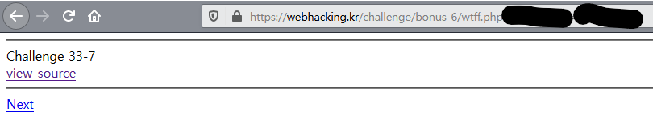
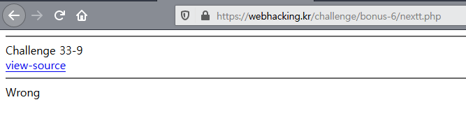

# Week_4) Wargame Write-up


먼저 Write-up을 작성하기에 앞서, php의 경우, 옆 스터디에서 이미 php에 MySQL까지 패키지로 이미 요약을 완료하였기에, 한 번 더 했다간 노트북 앞에서 코피를 흘리며 쓰러질 것 같아서 우려먹었습니다.  정말로 죄송합니다. 그런 의미로 워게임 Write-up을 더욱 열심히 작성하겠습니다. 33번 생각만 해도 눈 앞이 흐려지긴 하는데.......


### 1. webhacking.kr - No.6

이것이 문제가 아니다. 정말로 정말로 문제가 되는 것은 이 놈이 아니다. 대망의 33번을 향헤 빨리 가야한다.

##### 1)  문제 파악


- 쿠키로 인해 ID와 PW가 박혀있다.

```php+HTML
 <?php
include "../../config.php";
if($_GET['view_source']) view_source();
if(!$_COOKIE['user']){
  $val_id="guest";
  $val_pw="123qwe";
  for($i=0;$i<20;$i++){
    $val_id=base64_encode($val_id);
    $val_pw=base64_encode($val_pw);
  }
  $val_id=str_replace("1","!",$val_id);
  $val_id=str_replace("2","@",$val_id);
  $val_id=str_replace("3","$",$val_id);
  $val_id=str_replace("4","^",$val_id);
  $val_id=str_replace("5","&",$val_id);
  $val_id=str_replace("6","*",$val_id);
  $val_id=str_replace("7","(",$val_id);
  $val_id=str_replace("8",")",$val_id);

  $val_pw=str_replace("1","!",$val_pw);
  $val_pw=str_replace("2","@",$val_pw);
  $val_pw=str_replace("3","$",$val_pw);
  $val_pw=str_replace("4","^",$val_pw);
  $val_pw=str_replace("5","&",$val_pw);
  $val_pw=str_replace("6","*",$val_pw);
  $val_pw=str_replace("7","(",$val_pw);
  $val_pw=str_replace("8",")",$val_pw);

  Setcookie("user",$val_id,time()+86400,"/challenge/web-06/");
  Setcookie("password",$val_pw,time()+86400,"/challenge/web-06/");
    
   // 쿠키가 없을 경우, guest와 123qwe를 이용해
   // str_replace와 base_64 (무려 20번) 인코딩을 거쳐서
   // 더럽고 화나는 쿠키를 작성하는 것을 볼 수 있다.
    
  echo("<meta http-equiv=refresh content=0>");
  exit;
}
?>
<html>
<head>
<title>Challenge 6</title>
<style type="text/css">
body { background:black; color:white; font-size:10pt; }
</style>
</head>
<body>
<?php
$decode_id=$_COOKIE['user'];
$decode_pw=$_COOKIE['password'];

$decode_id=str_replace("!","1",$decode_id);
$decode_id=str_replace("@","2",$decode_id);
$decode_id=str_replace("$","3",$decode_id);
$decode_id=str_replace("^","4",$decode_id);
$decode_id=str_replace("&","5",$decode_id);
$decode_id=str_replace("*","6",$decode_id);
$decode_id=str_replace("(","7",$decode_id);
$decode_id=str_replace(")","8",$decode_id);

$decode_pw=str_replace("!","1",$decode_pw);
$decode_pw=str_replace("@","2",$decode_pw);
$decode_pw=str_replace("$","3",$decode_pw);
$decode_pw=str_replace("^","4",$decode_pw);
$decode_pw=str_replace("&","5",$decode_pw);
$decode_pw=str_replace("*","6",$decode_pw);
$decode_pw=str_replace("(","7",$decode_pw);
$decode_pw=str_replace(")","8",$decode_pw);

for($i=0;$i<20;$i++){
  $decode_id=base64_decode($decode_id);
  $decode_pw=base64_decode($decode_pw);
}

// 디코딩의 로직은 단순히 위에서 더럽고 화나는 쿠키의 작성 방법을
// 거꾸로 한 것에 불과하다

echo("<hr><a href=./?view_source=1 style=color:yellow;>view-source</a><br><br>");
echo("ID : $decode_id<br>PW : $decode_pw<hr>");

if($decode_id=="admin" && $decode_pw=="nimda"){
  solve(6);
}

// 쿠키의 값을 디코딩한 값이 admin, nimda와 같이 나와야 함

?>
</body>
</html>

```

- https://webhacking.kr/challenge/web-06/?view_source=1


쿠키를 더럽고 화나는 방식으로 가공하여 사용하는 모습을 볼 수 있다.


##### 2) 문제 풀이


저걸 일일이 str_replace와 base_64인코딩을 스스로 하고 있는 건 도닦기일 것이므로, php 온라인 컴파일러를 사용한다.


- 광고는 필자가 Burp suite와 HTML 수정으로 날려버렸다.

따라서, 이 페이지의 ID와 PW값을 똑같이 인코딩하기 위해 이러한 코드를 위의 온라인 컴파일러에 입력하였다.

```php
  $val_id="admin";
  $val_pw="nimda";
  for($i=0;$i<20;$i++){
    $val_id=base64_encode($val_id);
    $val_pw=base64_encode($val_pw);
  }
  $val_id=str_replace("1","!",$val_id);
  $val_id=str_replace("2","@",$val_id);
  $val_id=str_replace("3","$",$val_id);
  $val_id=str_replace("4","^",$val_id);
  $val_id=str_replace("5","&",$val_id);
  $val_id=str_replace("6","*",$val_id);
  $val_id=str_replace("7","(",$val_id);
  $val_id=str_replace("8",")",$val_id);

  $val_pw=str_replace("1","!",$val_pw);
  $val_pw=str_replace("2","@",$val_pw);
  $val_pw=str_replace("3","$",$val_pw);
  $val_pw=str_replace("4","^",$val_pw);
  $val_pw=str_replace("5","&",$val_pw);
  $val_pw=str_replace("6","*",$val_pw);
  $val_pw=str_replace("7","(",$val_pw);
  $val_pw=str_replace("8",")",$val_pw);


echo("ID : $val_id<br>PW : $val_pw<hr>");
```


그리고 나오는 값들은 hwp문서로 2페이지가 나오므로, 따로 결과를 적지는 않겠다. 하여튼 그렇게 나온 값들을 쿠키값에 넣어준다.


- 진짜 무지 길다.


##### 3) 결과


사실 이번에도 문서 작성 전, 미리 풀었다.

***


### 3. webhacking.kr - No.33

 필자는 이 문제를 Webhacking.kr을 들어왔을 때,  베이스가 없는 상태로 얼마나 풀 수 있을까라는 호기심에 이것 저것을 건들일 때 처음 만났다.

 정말 우여곡절끝에 겨우 푼 문제이다. Burp suite의 존재를 몰라 메모장을 이용해 직접 폼을 작성하여 HTTP 프로토콜을 날렸고, 쿠키에디터와 크롬 콘솔을 이용해 쿠키를 조작하며 풀었다. 하지만, 이번에는 Burp suite가 있으니, 훨씬 빨리 풀릴 것이라 기대한다.

 하지만. 하지만. 도대체 time을 md5로 인코딩한 그것을 어떻게 스샷까지 찍어가며 풀 것인가. 해봐야 알 거 같긴 하지만 한숨이 나온다.


- 도닦기의 흔적. 지금은 다른 문제를 풀기 위한 코드가 적혀있는 모양이다. 


##### 1) 문제 파악


- 우리 모두 저 33뒤의 -1이란 부분에서 이 문제를 지나쳐야 했다.


##### 2) 문제 풀이

###### 1번 :  GET Request 이용

```php+HTML
<hr>
Challenge 33-1<br>
<a href=index.txt>view-source</a>
<hr>
<?php
if($_GET['get']=="hehe") echo "<a href=???>Next</a>";
// GET Request를 확인한다.
else echo("Wrong");
?>
```


단순히 GET의 'get'이  'hehe'이면 되는 문제이다. 저 웃음은 사악한 웃음이다.


그저 URL만 수정해주어도 Next a태그를 뱉어낸다.


###### 2번 : POST Request 이용


```php+HTML
<hr>
Challenge 33-2<br>
<a href=lv2.txt>view-source</a>
<hr>
<?php
if($_POST['post']=="hehe" && $_POST['post2']=="hehe2") echo "<a href=???>Next</a>";
// 위 문제랑 다 똑같은데 GET만 POST로 바뀌었다.
else echo "Wrong";
?>

```

이번엔 POST를 이용한다. 필자가 여기서부터 막혔었다. 그 때 몇 문제 되지 않을거라 생각하고 메모장을 꺼내서 Form을 작성하던 필자에게 Stay를 외치고 싶다.


Burp suite의 Proxy에서 Request를 Post로 변경하고, body를 작성하여 Forward한다. 그리고 나타나는 Nest a태그. 사실 Burp suite에서 어떻게 Post 요청으로 바꾸는지 몰라 좀 헤멨다.


###### 3번 : GET Request + 서버함수


```php+HTML
<hr>
Challenge 33-3<br>
<a href=33.txt>view-source</a>
<hr>
<?php
if($_GET['myip'] == $_SERVER['REMOTE_ADDR']) echo "<a href=???>Next</a>";
// $_SERVER를 이용하여 사용자의 IP를 가져온다. 이것이 이 문제의 핵심이 된다.
else echo "Wrong";
?>
```


이번엔 1번의 응용이다. 내 아이피를 GET으로 입력하면 된다. nslookup으로도 공인아이피를 얻어낼 수 있는 방법이 있긴 하는 모양이지만, 귀찮으므로 구글로 간다.


이번에도 순순히 Next a태그를 뱉어준다.


###### 4번 : GET Request + time() + md5 암호화

아... 보기만 해도 화가 나는 문제이다.


```php+HTML
<hr>
Challenge 33-4<br>
<a href=l4.txt>view-source</a>
<hr>
<?php
if($_GET['password'] == md5(time())) echo "<a href=???>Next</a>";
// time()을 md5로 암호화하여, 그 값이 맞으면 a태그를 뱉겠단다.
else echo "hint : ".time();
?>
```


원래는 이 문제의 time을 통해 대충 30초 후의 time을 md5로 인코딩하여 그 때까지 새로고침을 하는 방법을 사용하였다. 하지만, 이번에도 도구를 사용해보기로 하였다. 다행히, php코드를 만들어 iframe으로 제공해주는 통큰 사이트가 존재하였고, 코드를 실행해보기로 하였다.


```php
<?php
$pw = md5(time());
header( "Location: https://webhacking.kr/challenge/bonus-6/l4.php?password=$pw" );
?>
```


- http://phptester.net/


예전에 했던 개고생이 이렇게 허탈하게 물거품이 되었다. 링크 주소를 복사해 다음 단계로 넘어간다.


###### 5번 : GET Request + POST Request + 쿠키


```php+HTML
<hr>
Challenge 33-5<br>
<a href=md555.txt>view-source</a>
<hr>
<?php
if($_GET['imget'] && $_POST['impost'] && $_COOKIE['imcookie']) echo "<a href=???>Next</a>";
// 종합선물세트이다. GET, POST, 쿠키 모두를 사용해 검증한다.
else echo "Wrong";
?>

```


Get, Post, Cookie를 모두 사용한다. 모두 다 Burp suite를 이용하여 조작할 수도 있겠지만, 쿠키를 조작하는 툴이 있는데 그러는 것은 낭비이므로, 쿠키는 쿠키에디터, 메서드는 Burp suite를 이용해 조작해주도록 하자.


예전에 했던 개고생 하나가 더 이렇게 물거품이 되었다.


###### 6번 : 서버함수 + md5 암호화


```php+HTML
<hr>
Challenge 33-6<br>
<a href=gpcc.txt>view-source</a>
<hr>
<?php
if($_COOKIE['test'] == md5($_SERVER['REMOTE_ADDR']) && $_POST['kk'] == md5($_SERVER['HTTP_USER_AGENT'])) echo "<a href=???>Next</a>";
else echo "hint : {$_SERVER['HTTP_USER_AGENT']}";
// $_SERVER 값을 md5로 암호화하여 Post와 쿠키를 이용해 검증한다
?>
```

이번에도 Post, Cookie를 사용하는데, 모두 서버 함수를 사용한다. 그러나 브라우저의 값은 텍스트로 제공해주므로, 우리는 아이피만 알아내어 둘 다 md5 암호화해주어 값을 전달해주면 된다.


필자는 잘못된 해시생성기를 사용하여 a~f까지의 숫자가 다 대문자로 나와 한동안 왜 안되는지 찾느라 헤멨다.


###### 7번 : 서버함수 + str_replace


```php+HTML
<hr>
Challenge 33-7<br>
<a href=wtff.txt>view-source</a>
<hr>
<?php
$_SERVER['REMOTE_ADDR'] = str_replace(".","",$_SERVER['REMOTE_ADDR']);
if($_GET[$_SERVER['REMOTE_ADDR']] == $_SERVER['REMOTE_ADDR']) echo "<a href=???>Next</a>";
// 서버함수로 아이피를 알아내 그것을 str_replace로 조작하여 검사한다.
// 하지만, 눈대중으로도 어떻게 바꾸어야 할 지 보인다.
else echo "Wrong<br>".$_GET[$_SERVER['REMOTE_ADDR']];
?>

```

서버함수의 아이피와 str_replace를 이용한 문제이다. 하지만, 조작 자체가 단순해 크게 어려움은 없다. 본인의 아이피에서 '.' 을 없앤 후, 그것을 GET의 변수명과 값으로 전달하면 될 것이다.



앞의 문제들에 비하면 정말로 간단하다.


###### 8번 : 서버함수


```php+HTML
<hr>
Challenge 33-8<br>
<a href=ipt.txt>view-source</a>
<hr>
<?php
extract($_GET);
if(!$_GET['addr']) $addr = $_SERVER['REMOTE_ADDR'];
if($addr == "127.0.0.1") echo "<a href=???>Next</a>";
// 그저 addr이란 Get 변수가 있는지 확인하고
// 없으면 접속자의 아이피로 검증한다
// 아이피가 127.0.0.1일 경우로 조작하면 된다.
else echo "Wrong";
?>
```

훨씬 쉬운 문제이다. PHP에 이런 문법이 있다-라는 것을 보여주려는 의도인가 싶을 정도로.

addr이란 GET변수에 127.0.0.1을 담아 보내주면 바로 해결된다.

사실 화면을 캡쳐하기도 전에 풀어버렸다.


앞의 문제들에 비하면 정말로 , 훨씬 더 간단하다.


###### 9번 : 문자열

끝이 보인다. 이제 2문제 남았다.



```php+HTML
<hr>
Challenge 33-9<br>
<a href=nextt.txt>view-source</a>
<hr>
<?php
for($i=97;$i<=122;$i=$i+2){
  $answer.=chr($i);
}
// 아스키코드의 소문자가 97부터 시작한다는 것을 생각하자
// answer라는 문자열은 대문자를 헌칸씩 건너뛰어 만들어진 문자열이다.
if($_GET['ans'] == $answer) echo "<a href=???.php>Next</a>";
else echo "Wrong";
?>
```

 for문과 chr라는 함수를 이용해 answer라는 문자열을 만드는데, 이 과정이 상당히 단순해 PHP파일로 올리는 속도와 직접 문자열 작성 중 뭐가 빠를까 고민하게 된다.

알파벳의 홀수번째 소문자들을 모두 모아 문자열을 만들어준 후, GET으로 넘긴다.


다만, 문자열을 입력하다가 오타라도 나면 위의 어지간한 문제보다 어려워질지도 모르겠다.


###### 10번 : 서버 함수 + 문자열

드디어 도저히 나올 것 같지 않던 마지막 문제이다. 이 문제를 해결하면 solve함수에 접근할 수 있다.


```php+HTML
<hr>
Challenge 33-10<br>
<a href=forfor.txt>view-source</a>
<hr>
<?php
$ip = $_SERVER['REMOTE_ADDR'];
for($i=0;$i<=strlen($ip);$i++) $ip=str_replace($i,ord($i),$ip);
$ip=str_replace(".","",$ip);
$ip=substr($ip,0,10);
$answer = $ip*2;
$answer = $ip/2;
$answer = str_replace(".","",$answer);
$f=fopen("answerip/{$answer}_{$ip}.php","w");
fwrite($f,"<?php include \"../../../config.php\"; solve(33); unlink(__FILE__); ?>");
fclose($f);
// 아이피주소를 정말 복잡하게 꼬아놓은 문자열을 사용해 php파일을 만들고,
// 그 파일 내부에서 solve(33) 함수를 실행한다.
// 우리는 그 파일에 접근해야 한다.
?>
```

필자는 이 문제를 혼자서 풀어볼 때 계산기와 메모장을 이용해 풀다가 결국 틀려서 깔려있던 WAMP까지 꺼내보는 경지에 이르렀었다. 이번에도 계산기와 메모장가지곤 어림도 없다는 것을 알기에 속편하게 PHP온라인컴파일러를 꺼내들 것이다.


정말로 간단하게 값들을 알아낼 수 있다.


이제 이 값들을 이용하여 answerip/(answer)_(ip).php 문서에 들어가기만 하면 33번은 풀리게 된다.


##### 3) 결과


내가 이겼다!  사실 이미 팬 놈 어떻게 하면 더 체계적으로 패는 지 알아보기 위해 다시 팬 꼴이지만.


마트료시카마냥 까도 까도 계속 다음 레벨이 나오는 이 문제를 보면서 디렉터리 인덱싱을 연습하는 문제인가...? 라는 생각이 들 정도였다. 모로가나 서울왔으면 됐으니 생각한다.

***

