# Week_5) Wargame Write-up

### 1. XSS-game 1번

이것이 문제가 아니다. 정말로 정말로 문제가 되는 것은 이 놈이 아니다. 대망의 33번을 향헤 빨리 가야한다.

##### 1)  문제 파악

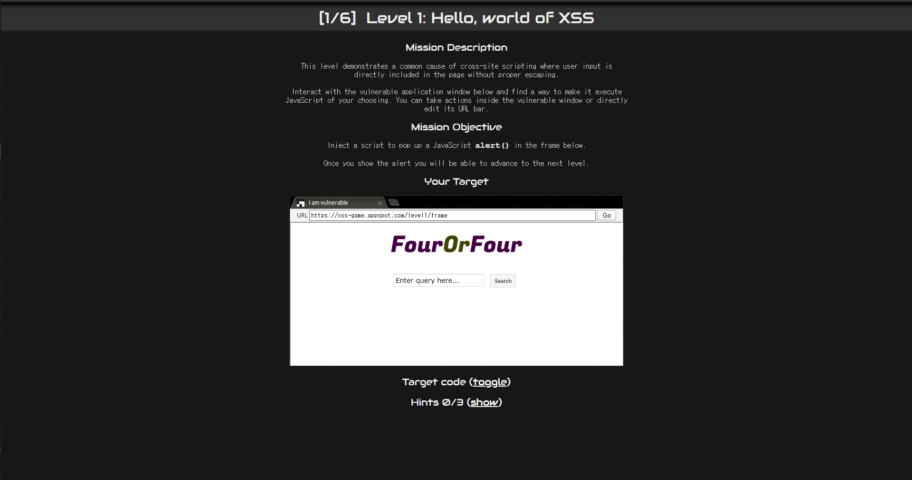

대놓고  를 쓰고 싶게 생겼다.

##### 2) 문제 풀이

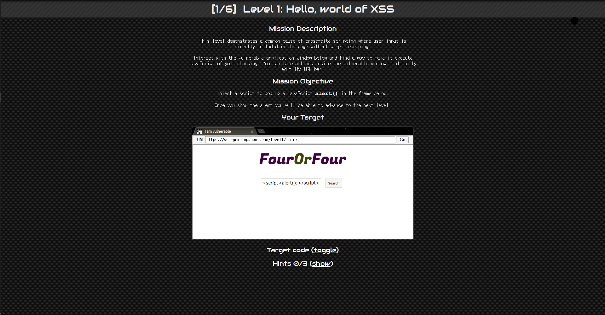

입력하면

##### 3) 결과

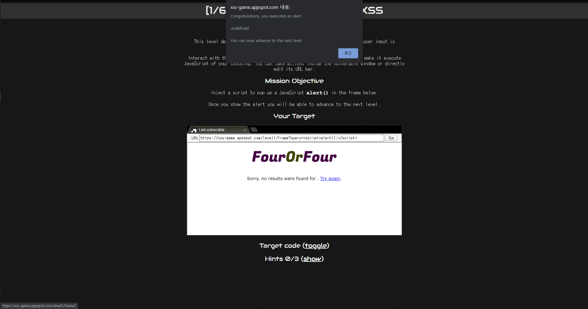

뿅

Reflect XSS를 쓰라고 만들어둔 것 같으나, 한 번에 통과되어서 어떻게 되먹은건지 원.

***

### 2. XSS-game 2번

##### 1)  문제 파악

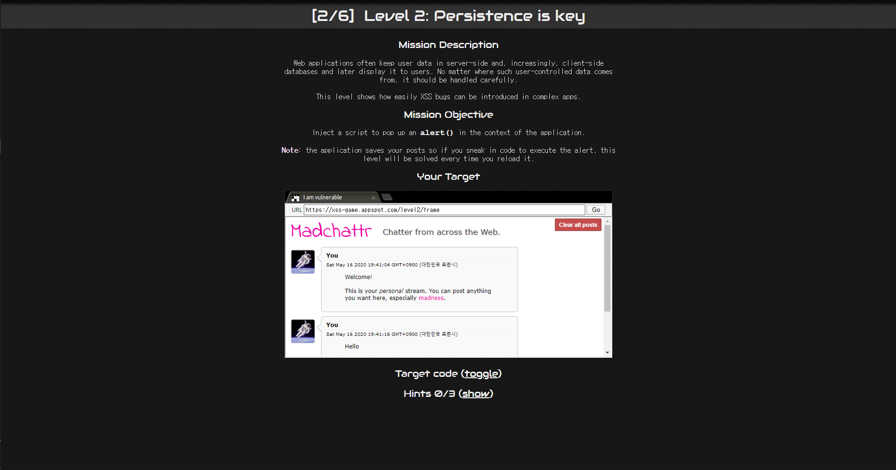

간단하게 Hello를 입력했더니 그대로 뱉어준다. 게시판 사이트에 쓰여있는 이상한 글들은 무시하자.

##### 2) 문제 풀이

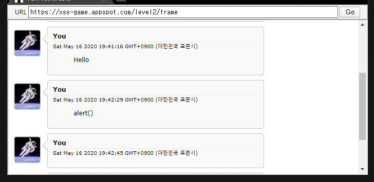

오타가 나서 그대로 출력된 것은 무시하자. 

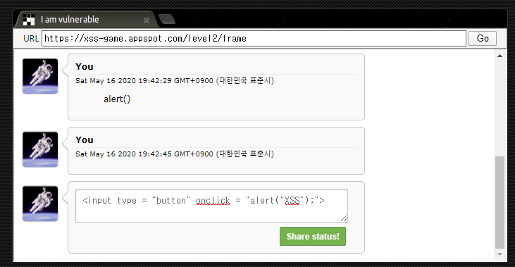

button을 하나 만들어준 후,

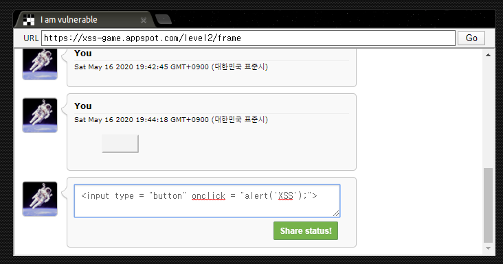

버튼을 눌러주면

##### 3) 결과

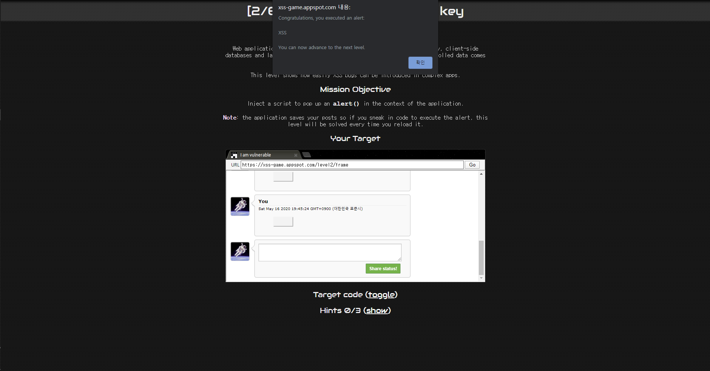

클리어

사실 img 태그의 onerror로 하는 것이었다 (...)

***

### 2. webhacking.kr 23번

##### 1)  문제 파악

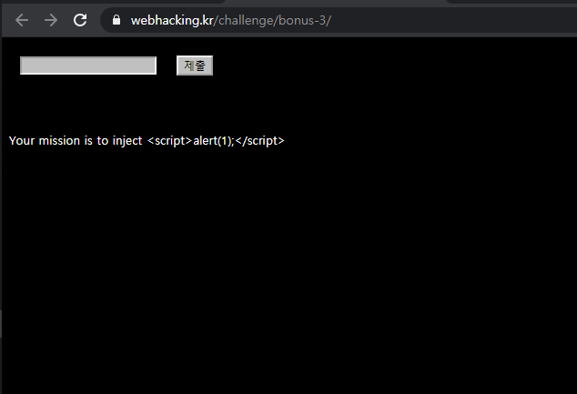

webhacking.kr에서 처음으로 항복하고 솔루션을 찾아보게 만들었던 문제였다.

먼저,  을 입력해보면,

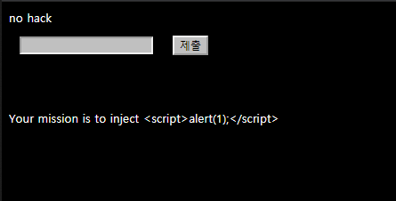

기다렸다는 듯이 no hack이 나온다.

언제 no hack이 나올까. 여러가지를 넣어보면서 찾아보기로 하였다.

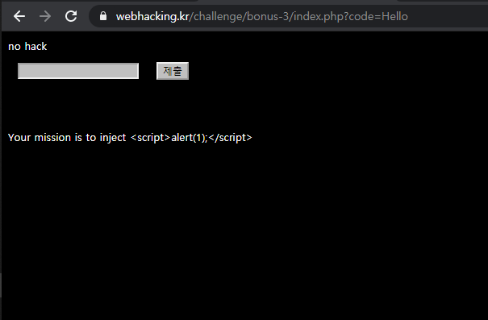

Hello를 치면 안된다. 일반 알파벳은 막은 듯 하다.

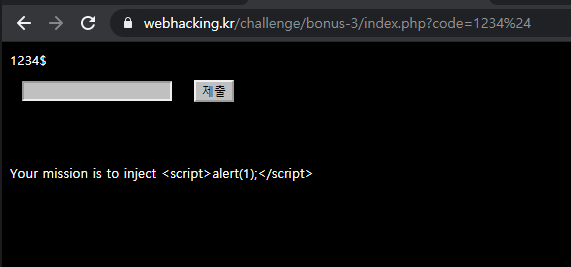

숫자와 기호는 막지 않았다. 잠깐, 그러면........

##### 2) 문제 풀이

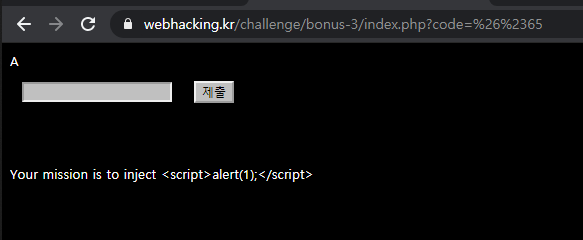

A의 HTML escaping인 &#x65를 입력해보니 그대로 출력된다. (물론 이때 나는 알파벳이 작동하지 않는다는 가설을 폐기했어야 했을지도 모른다.) 이를 바탕으로 문제의 구문을 HTML escaping을 해서 넣어보았다.

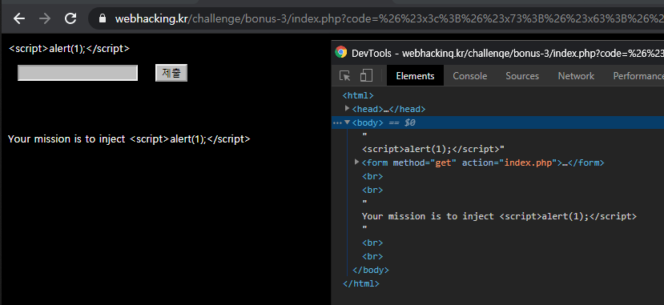

.......

저 따옴표를 없애는 방법을 한참동안 찾아보았으나, 결국에는 실패하고 솔루션을 찾아보았다. 

사실 저것의 규칙은 문자열의 연속을 검사하는 문법이었었다. 전혀 예상하지 못했던 부분. 그러니 중간중간에 null을 넣으면 해결된다는 해답이었다. 그리고 그대로 따라해보니....

##### 3) 결과

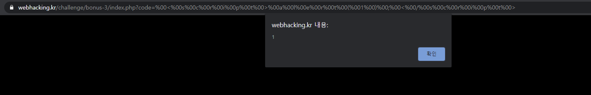

상당히 억을했던 문제였다.

***

