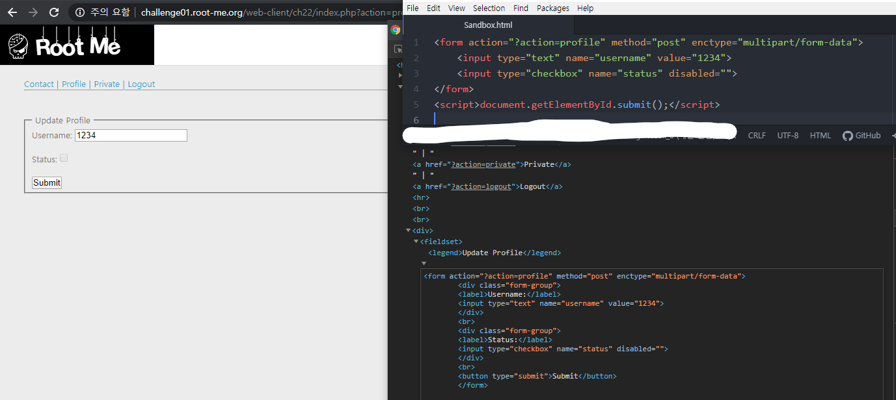
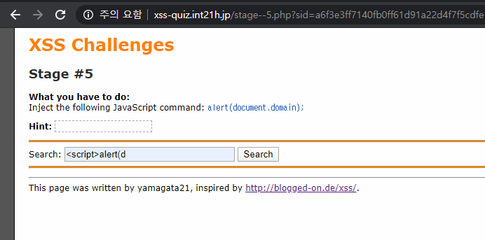
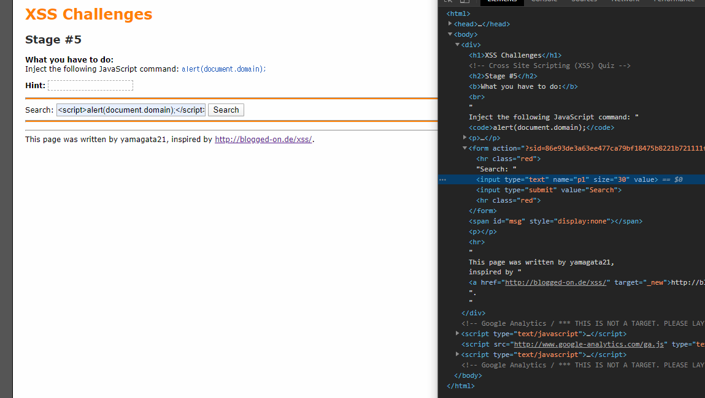

# Week_6) Wargame Write-up

최근, 이것저것 프로젝트를 많이 하다보니 눈코뜰 새 없이 바빠서 깜빡하고 과제를 제출하지 않았습니다.

앞으로 이런 실수를 하지 말아야 할텐데 큰일입니다.


마감 문자를 받자마자 시작하였지만, 다행히 저번 주에 미리 CSRF까지 미리 다 공부해둔 상태라 문제를 바로 풀었습니다.

### 1. root me.org - CSRF - 0 protection

##### 1)  문제 파악


로그인이 필요한 듯 하다. Register에 가서 가입해주자.


ID 1234에 비밀번호 1234로 가입하였다. 아까 풀 때 이미 가입해서 그런지 User exist :( 가 뜬다.

그러면 다음과 같은 창이 뜨게 된다. 아마 admin으로 접속해서 Status를 수정해야하는 모양이다.


그리고 Contact를 클릭해보면 관리자에게 메일을 보낼 수 있다.


아마 이 이메일로 폼을 보내 CSRF를 진행하면 될 것이다.

##### 2) 문제 풀이



profile 탭에서 폼을 긁어와준다. 그것을 아톰을 이용해 대강 수정해준 후,


메일로 발송해보자.

##### 3) 결과


뿅


처음에는 hidden타입을 이용해서 도전해봤는데 처참하게 실패하고 자꾸 이것저것 시도했지만 기어코 작동하지 않아 책상을 쾅쾅 쳤던 기억이 난다. 도대체 그 코드는 어디서 망가져서 작동을 안한 것인지 도통 이해가 안된다.

***

### 2. xss-quiz #1 ~ #5

##### 1)  문제 파악


단계식 사이트라는데, 이걸 다 풀 수 있을 지 모르겠다.

일단 1번부터 천천히 풀어나가자. 누가봐도 Reflected-XSS를 사용하는 문제이다.

##### 2) 문제 풀이

###### 1. Stage #1


스크립트를 넣어준 후, Search를 해주면


간단하게 풀리게 된다. 이 얼마나 쉬운가.

###### 2. Stage #2

이 문제는 도저히 못풀겠어서 인터넷에 찾아본 문제인데, 상당히 신세계였다.


용감하게 다시 그 방법을 시도해보았지만....


어림도 없다!!! 암!!!! 아아암!!!

을 외치는 동영상이 생각난다.


그래서 힌트를 보고 </p>, </form> 등, 다양한 종료태그를 사용해봤지만, 결과는 처참했다. 하이고.

인터넷에 찾아본 결과, ">을 쓰라는 말을 듣고 반신반의로 해보니...


그대로 패스. 해보고도 엄청 신기하고 잔머리 잘굴렸다는 생각만 엄청 들었다.

###### 3. Stage #3


용기있는 자에겐 기회가 오나니.


어림도 없다!! 암!! 아아암!!!!!


그러고보니 이 Japan이란 부분이 갑자기 뜬끔없이 나타났다. 그러면......


스크립트를 작성하여 <option>을 수정하였는데, 저렇게 되어버렸다. 참고로 저기 옵션은 선택하지 않은 것이 아니라 스크립트를 작성한 옵션을 선택했는데도 저러는 것이다. 생각을 해보니, HTML escaping을 하면 되지 않을까? 라는 생각이 불현듯 떠올랐고,

```&lt;script&gt;alert(document.domain);&lt;/script&gt;```

라는 문자열을 가져왔다. md파일에서 이스케이핑 되어버리네.

하여튼 저 문자열을 삽입하자......

​	

오.


하...... 요즘따라 혼자 문제를 풀어보려 해도 안풀려 인터넷을 자주 보게 되었는데, 오랜만에 자력으로 문제를 푸니 기분이 좋다.

###### 4. Stage #4

슬슬 긴장되기 시작한다. 5번은 얼마나 어려울까.


아까전과 똑같이 생겼다.


한 번은 되지 않을까...?


입구컷.

소스코드창을 뜯어보니, Hidden 속성의 input이 하나 보인다.

설마 여기를 공략하는 것인가.


코드를 넣어보았으나,


똑같은 창이 아니다. Search 버튼을 눌렀음에도 입구컷 당한 것일 뿐.

그런데, Hidden input값이 초기값으로 돌아가지 않은 것이 눈에 띈다. 아.

자신의 태그를 종료하는 Reflected-XSS를 시도해보자.

```
&quot;&gt;&lt;script&gt;alert(document.domain);&lt;/script&gt;
```


떨리는 마음으로 시도해본 결과.


깔끔하게 성공했다.

###### 5. Stage #5



이번에도 먼저.... 입력해보려고 했지만.

이것이 바로 입구컷이란 것인가. 더 이상 입력이 되지 않는 것을 보아하니 HTML의 Maxlength 길이제한이 걸려있을 것이다. 사실 묻지도 따지지도 않고 이미 힌트를 본지라 입력 전부터 알고 있었다.



이제 MaxLength를 지워준 후, 다시 시도해보자.


어림도 없다!!! 암!!! 아아암!!!

후. 다시 코드를 뜯어보자. 이번에도 하나 보이는 것이 있다. 내 입력이 고스란히 다시 Form으로 들어가는 것이 보인다. 이렇다면......


Escaping된 문자열을 가져와서 자신의 태그를 닫은 후 <script>를 삽입하는 Reflected-XSS를 시도해보자.

##### 3) 결과


이 퀴즈를 다 풀면 Reflect-XSS에 도가 틀 것 같다. 확실히 이번 퀴즈 이후로, 입력을 그대로 반환하는 모든 부분에 대해 점검하게 되었으니. Escaping을 해주지 않으면 확실히 위험한 공격법같다.

***


