# Week_7) Wargame Write-up

해킹팀에 처음 왔을 때, 조금 늦게 들어오는 바람에 작년 학기 때는 해킹 스터디에 가입하지 못했던 기억이 납니다. 그 때 팀장분에게 받았던 자료가 Bandit이라 감회가 좀 새롭습니다. 이삭님 멘토링 때 리눅스를 이미 깔았던지라, 그에 대하여 약간의 설명을 한 후에 본격적으로 문제 풀이를 시작하고자 합니다.

### 0. Ubuntu 18.04 LTS installation - WSL2

처음에 VMware를 설치하라는 멘토링의 조언에 약간의 아쉬움이 있었다. VMware는 윈도우 위에 가상으로 돌아가는 시스템이다보니, 마우스 조작도 상대적으로 불편하고 파일 시스템을 조작하는 데에도 불편하기 이를 데 없었으며, 반응속도나 네트워크 제어도 상당히 빡빡했던 것으로 기억한다. 그래서 찾아본 것은 WSL, 즉 Windows Subsystem for Linux였는데, 이게 그 때 당시로는 완전히 독립적인 리눅스 커널을 얹은 것이 아니라는 말을 듣고 실망하였었던 기억이 난다.

그러나, 개발자 프로그램에 마침 WSL2가 업데이트 되며, 완전히 독립된 커널을 사용한다는 말을 듣게 되었고, 과감하게 윈도우 참여 프로그램에 가입하여 2004 업데이트를 받아 WSL2를 설치하였다. 그 과정이 얼마나 복잡하고 힘들었는지는 따로 설명하고 싶은 생각이 안 든다.

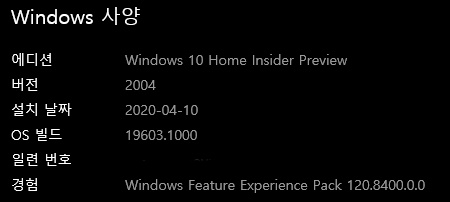

- 윈도우 버전. WSL2를 사용하기 위해 2004버전이다. 그러한 이유로, 필자는 현재 불완전한 시스템으로 인한 알 수 없는 오류에 고통받는 중이다. 특히 한글 입력에서 상당한 에러가 사방팔방에서 나는 중이다.

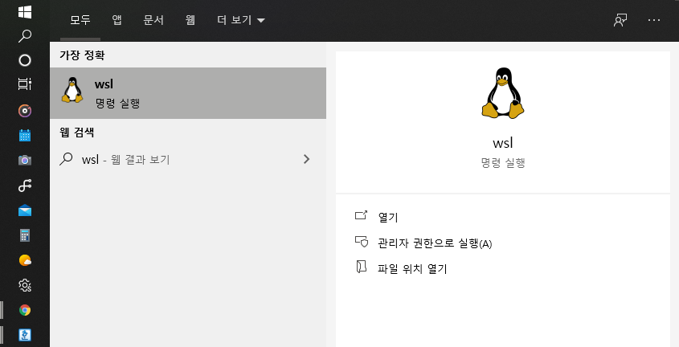

- WSL을 실행하기 위해 명령을 입력한 상태.

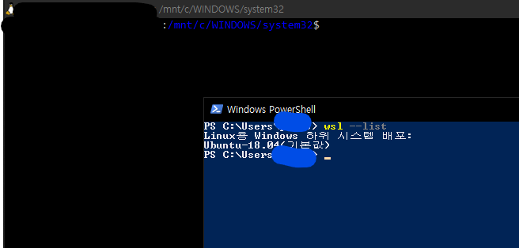

- Powershell과 실제 WSL2 콘솔.

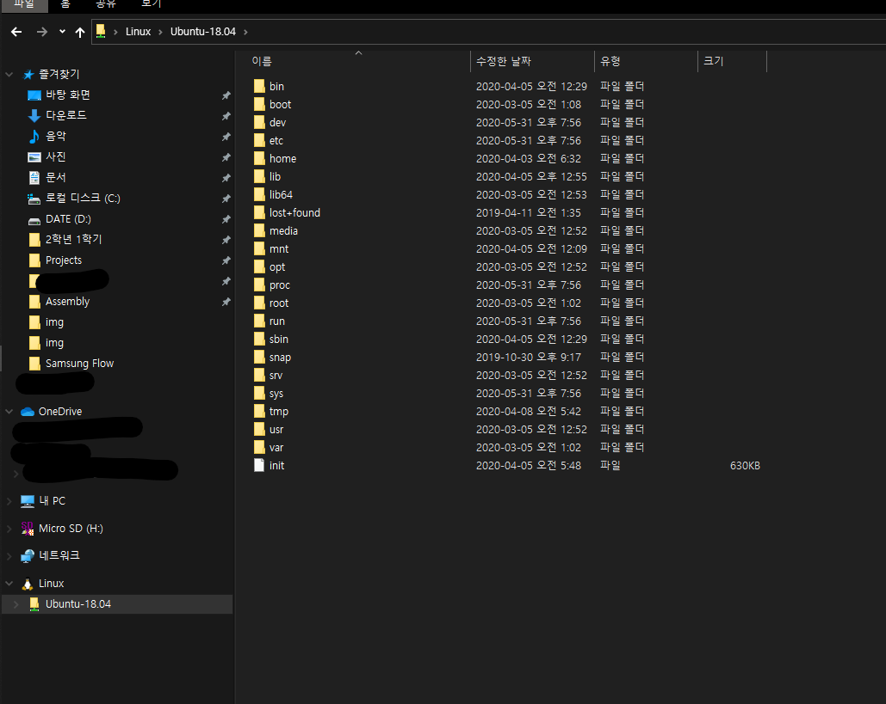

- 무려 윈도우 파일 탐색기에서 리눅스 파일을 조작할 수 있다!!! FileZilla와는 비교가 안되는 편리함을 보여준다.

최근에 Ubuntu 20.04 LTS가 나왔던데. 아....... 음.......

### 1. Overthewire.org - Bandit

##### 1)  Level 0

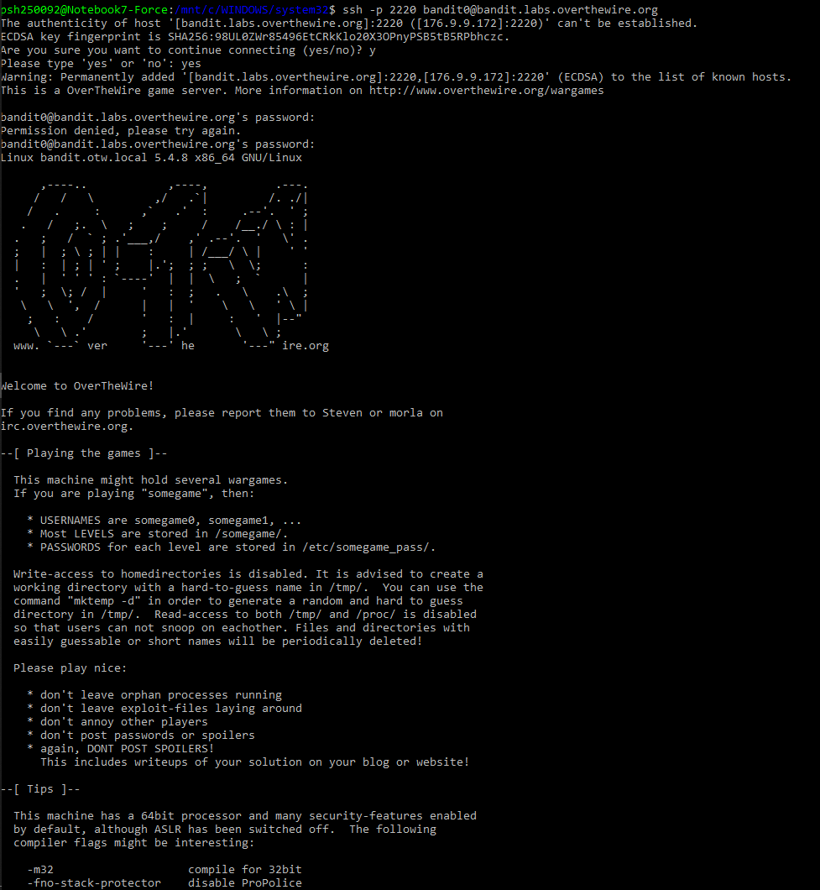

Github에 올라가는 자료라 시스템에 대해 알려질만한건 모두 지우려 했지만, 이젠 귀찮아서 그럴 마음도 사라졌다.

ssh명령어의 -p 플래그를 통해 포트를 설정하고, 비밀번호를 입력하면 이렇게 접속하게 된다.

##### 2) Level 0~1

문제를 해석하여보면, 파일 시스템에 readme 파일에 패스워드를 저장하였으니, 그를 통하여 bandit1로 로그인하라고 나온다.

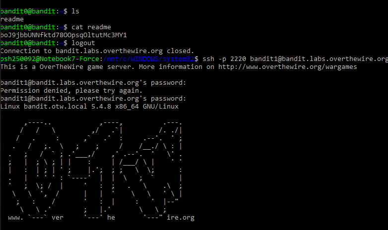

이삭님 멘토링에서 인터넷 프로그래밍 과제와 겹쳐서 혼자서만 JSP로 게시판 사이트를 만든 적이 있었다. 이를 호스팅하기 위해서 AWS EC2 서버를 쓴 적이 있는데, 하필 MySQL7과 Java 12버전을 써서 apt-get으로 설치할 수 없게 되어 하루종일 개고생을 한 적이 있었다.

그 때 신물이 나도록 쓴 것이 ls와 cd, cat, pwd였는데, 이를 까먹을 리가 없지.

##### 3) Level 1~2

2번부터 막혀서 어쩔 수 없이 검색할 수 밖에 없었다. 이 페이스라면 오늘 도 지각인데. 큰일났다.

파일명이 '-' 인..... 파일을 열어서 확인하라고 한다. 누가 이런 파일을 만든다고.

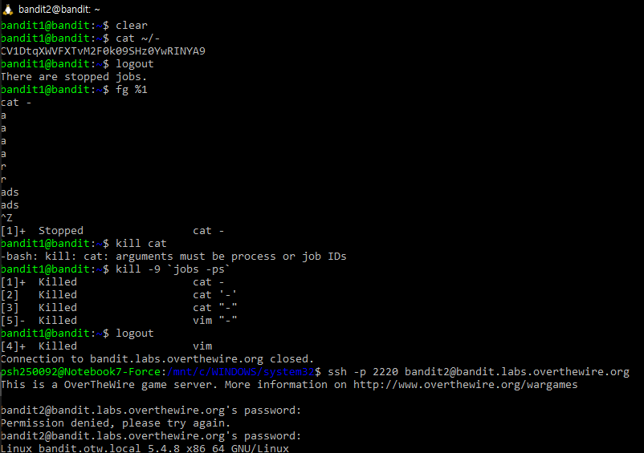

중간에 kill -9 'jobs -ps'의 결과를 보면 알겠지만, -를 먹이면 프로세스들이 옵션이라 인식해서 멈춰버리는 일이 있었던지라 상당히 고생하였다. 모두가 겪는 일이라 생각하고 마음편하게 넘어가려 한다.

결국 정답은 이스케이핑이 아닌 상대경로를 이용하는 방법이었다. 여러 이스케이핑을 시도했었는데, 상당히 화가 난다.

##### 4) Level 2~3

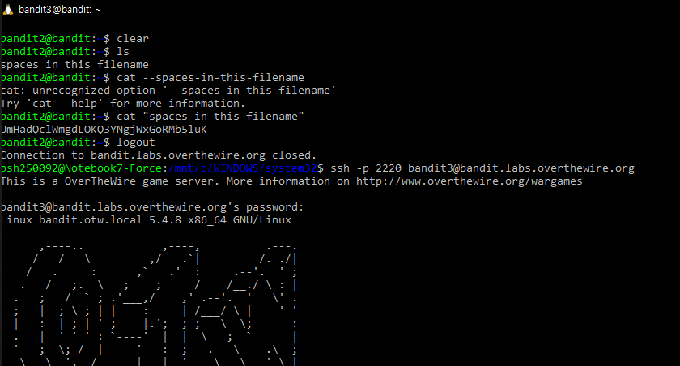

중간에 공백이 들어간 파일이 존재한다. 당연히 이를 그냥 열 수는 없을 것이다. 첫번째 단어인 spaces라는 파일을 열고 뒤는 잘못된 인자로 인식할 것이 뻔하다.

그러니 쌍따옴표로 묶어주자. 이 문제가 전 단계보다 훨씬 쉬운 것 같은 것은 기분 탓일까. 모두가 공백 이스케이핑을 할 줄 알텐데.

간단하게 패스워드를 알아내었으니, 다음 레벨로 넘어가자.

##### 4) Level 3~4

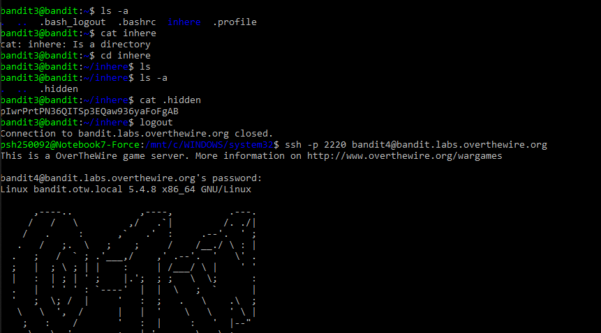

숨겨진 파일을 찾아서 열면 해결되는 문제이다. ls의 -a 옵션을 이용하면 간단하게 찾을 수 있는 문제이다. 딱히 어려울 건 없어보인다.

파일을 열어 패스워드를 확인하고 다음으로 넘어가자.

##### 5) Level 4~5

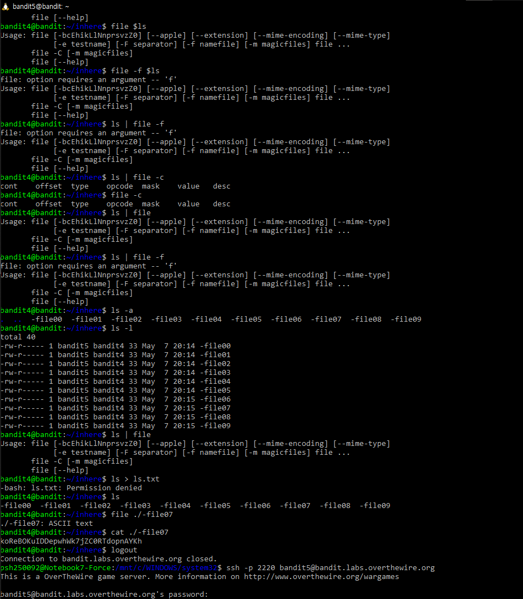

최근에 스터디하면서 배운 것 중 하나는 아예 모르는 것이 있다면, 해답을 찾는 것이 훨씬 빠르고 더 도움이 많이 된다는 것을 알게 되었다.

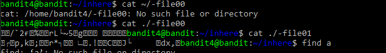

cat를 해보니 모두 다 깨진 문자열이다. ls를 해보니 파일 갯수가 대략 50개가 되던데, 그것을 모두 cat해볼 수 없는 노릇이라 생각하였다.

그래서 bash명령어를 찾아보아 ls | file -f를 시도해보았지만 결국 어떤 방법을 동원해도 안되는건 마찬가지.

결국엔 넷상에서 7번 파일이 답이라는 것을 확인하고서 (이 분도 결국엔 file을 모든 파일에 입력하여보신 분이다.) 문제를 풀었다. for이나 while문을 이용하면 될 것 같기도 하고.

나중에 다시 시도해보고 싶은 문제이다.

##### 6) Level 5~6

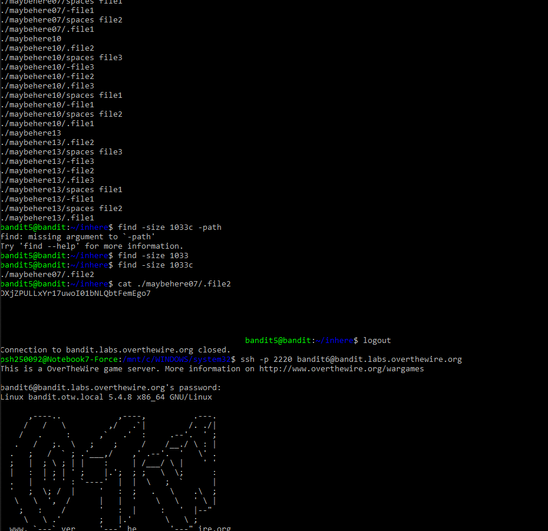

디렉터리 내에서 특정 조건을 만족하는 파일을 찾는 문제이다. 파일의 크기는 1033바이트, 실행할 수 없는 파일이며 사람이 읽을 수 있는 파일이란 조건이 걸려있다.

find 명령어를 사용하면 되는 문제인데, 바이트 수가 주어졌으니, size를 이용하여 찾아내면 될 것이다.

무엇보다 find 명령어를 통해서 파일 목록을 출력하니 저런 모양새가 나온다. 끔찍하기 이를 데 없다. 중간중간 공백있는 파일도 꼼꼼하게 넣어준 센스란.

##### 7) Level 6~7

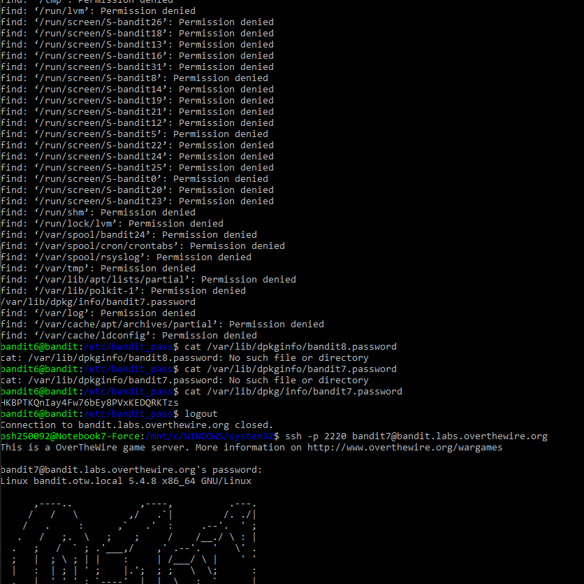

이 문제 또한 결국 어이없는 실수로 답을 찾아보게 했던 문제인데, 디렉터리가 비어있어서 어떻게 찾는 것인지 몰랐다가 Somewhere in server라는 말에 ../로 올라가 홈 디렉터리를 보니 도저히 감이 안잡혀 결국 답을 찾아놓고서는 허무하게 풀어버린 문제이다.

홈 디렉터리에서 find의 옵션인 -group과 -user, -size를 이용하여 검색해보면 /var/lib/dpkg/info/bandit7.password를 찾을 수 있게 된다.

잠깐 etc 디렉터리로 들어가 헤멨던 기억이 난다.

##### 8) Level 7~8

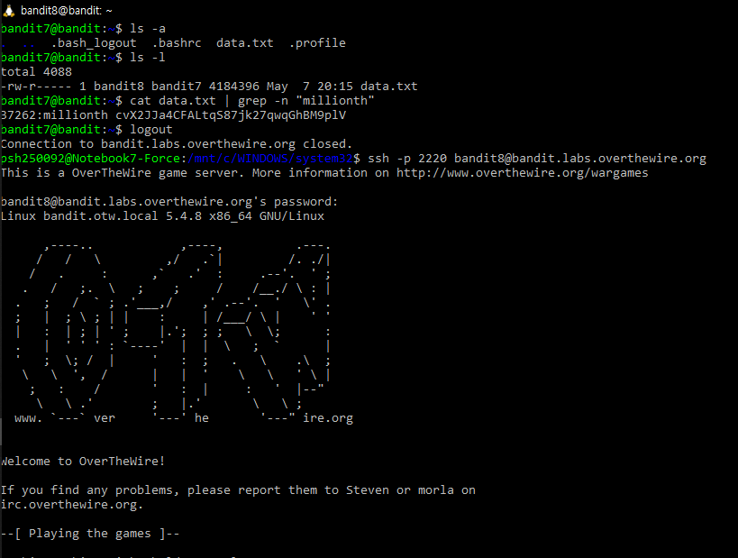

너무 많다....... 미리미리 할 걸.......

이번 문제 또한 꽤나 당황스러웠는데 data.txt를 cat로 열어보는 순간, 엄청난 문자열의 나열이 쏟어져 나왔다. 그래서 ls -l 명령어를 통해 확인해보니 4184396 bytes 되시겠다. 대충 4mb 정도 되는 ascii 문자열을 열었으니 콘솔은 당연히 개박살이 났고, reset을 쓰는 수 밖에 없었다.

이 문제는 pipe문자인 |을 이용하면 간단하게 풀리는 문제이다. cat data.txt를 grep명령어에게 |를 이용하여 전달하면 millionth 옆에 있는 키를 찾을 수 있다.

##### 9) Level 8~9

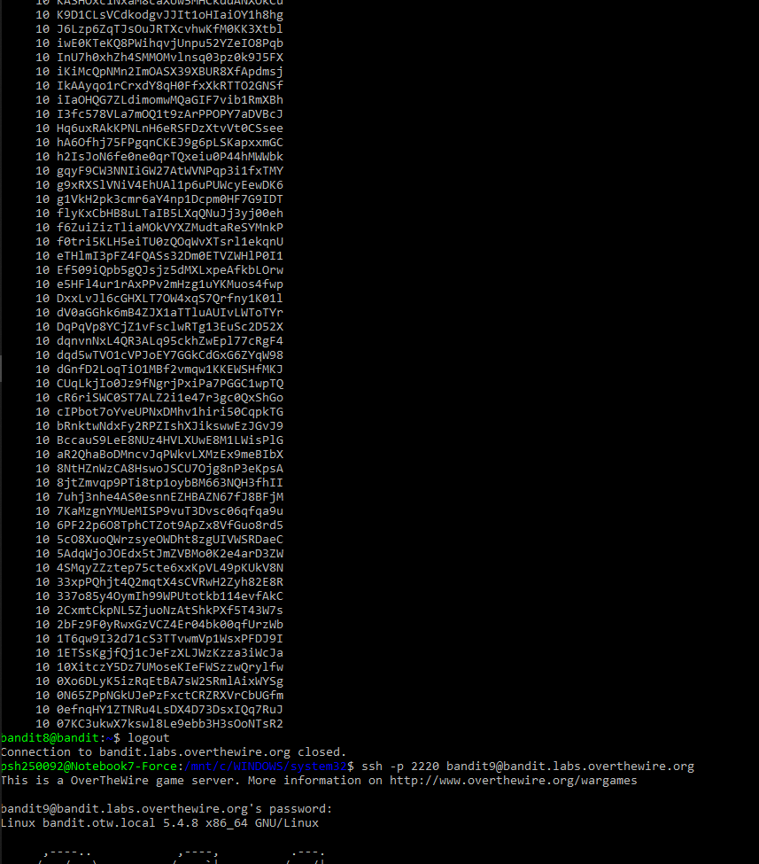

리눅스의 명령어를 고루고루 배워가는 느낌이다.

처음에는 grep의 {} 메타문자를 이용하여 1번만 겹치는 문자열을 추출하고자 하였으나, 제대로 작동하지 않아 밑에 comment를 보니 uniq와 sort를 찾을 수 있었고, 인터넷의 도움을 빌어 uniq -c 명령어를 사용하니 저렇게 깔끔하게 답을 뱉어준다.

33글자 해시 수십개를 10번씩이나 반복하다니, 이 얼마나 사악한가.

그래도 함수를 이렇게 배워가니 확실히 리눅스에 대하여 감을 잡아가는 느낌이다.

##### 10) Level 9~10

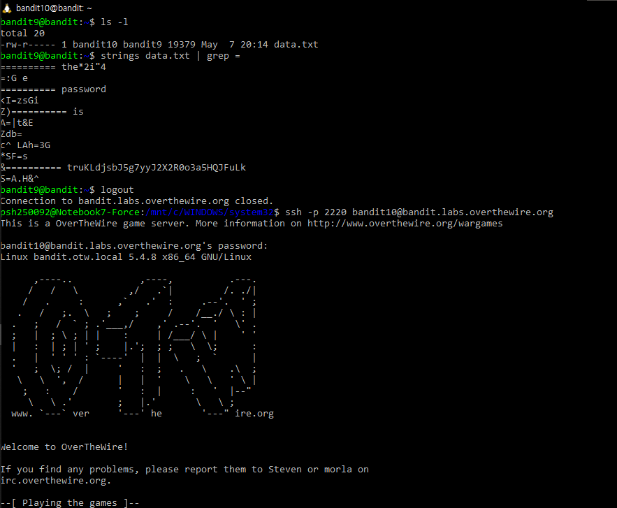

strings 함수를 이용하여 푸는 문제였다. 처음에 cat를 이용하니 이상하고 복잡한 바이너리 파일이 나를 반겼는데, 이것이 문제가 되어 grep으로 전달이 되지 않는 것을 확인하였다.

string을 이용하면, 바이너리 파일에서 문자열을 추출....... 해주기 때문에 grep에게 넘겨주어도 포맷이 맞게 된다.

그래서 문자에 나온대로 =을 이용해 검색을 하게 되면 몇몇 문자열이 나오게 되는 데, 저 기다랗고 누가봐도 해시같이 생긴 것이 필시 비밀번호가 될 것이다.

##### 11) Level 10~11

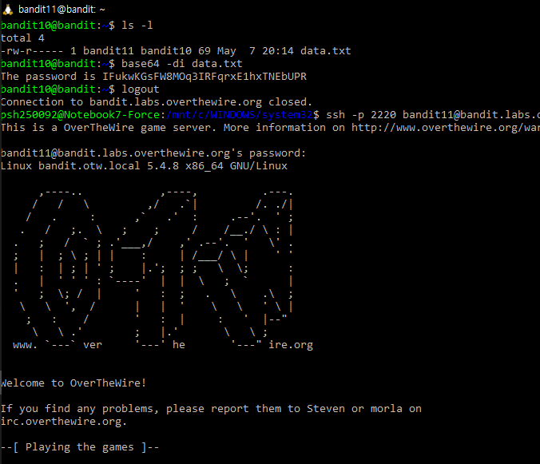

단순히 Base64로 인코딩된 문자열을 해독하면 되는 문제이다. 앞 문제들이 그렇게 쉬운 문제였다면 아마 제 시간에 제출이 가능하였을텐데.

리눅스에는 Base64가 기본적으로 내장되어있다는 사실이 신기하게 다가온다. data.txt를 base64 -di 명령어를 이용해서 디코딩해보면 코드가 나오게 된다.

피곤해서 그런지 글이 점점 짧아지는 듯하다. 하지만 거의 다 왔으니 조금만 더.......

##### 11) Level 11~12

이 문제를 풀 때 하필 12~13번을 누르는 바람에 허탕을 쳐버렸다.

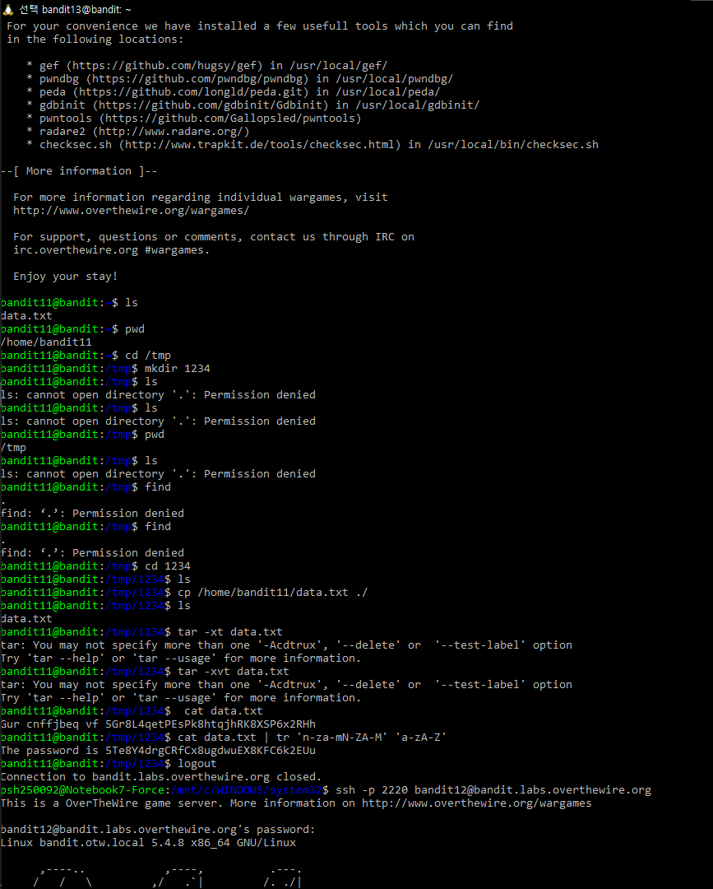

tr을 쓰면 되는 문제인데, cat로 보면 무슨 카이사르 암호마냥 생긴 문자열을 본 적이 있다 필자는 이 문제를 하필 13번과 헷갈려서 tmp 디렉터리로 옮기는 바보같은 실수를 하였지만, 영 피곤하니 어쩔 수 없는 실수라고 치부하고 넘기려고 한다.

cat를 통해서 결과를 얻은 후에 tr로 넘기면 된다. 문제에서 13번째 포지션으로 바꾸었다고 언급했으니, 그에 맞게 바꾸어주면 간단하다.

##### 13) Level 12~13

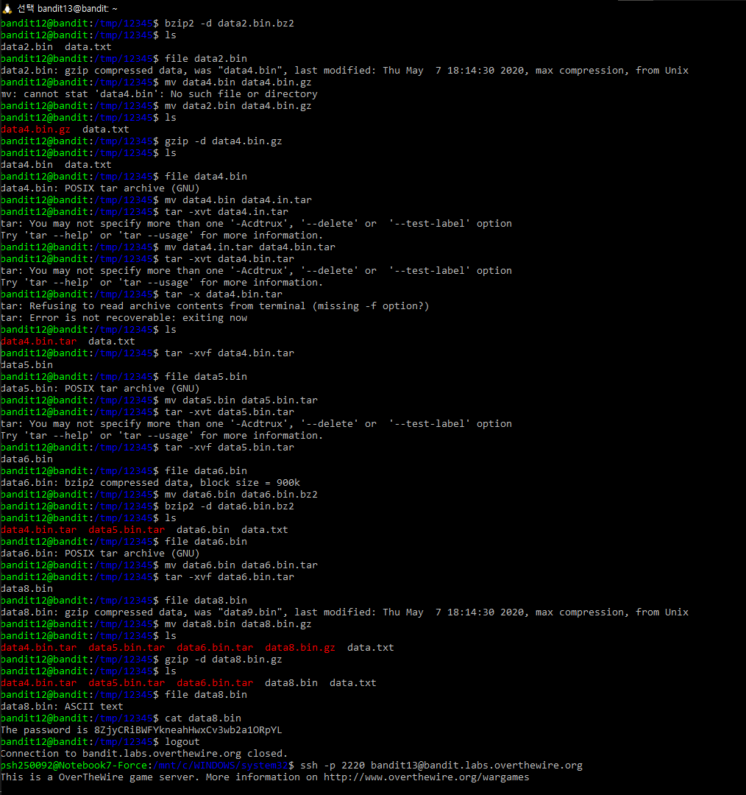

2문제 남았다. 이렇게 많을 줄 알았으면 미리미리 할 걸 그랬다는 후회가 물밀듯이 밀려온다.

이번문제는 완전히 노가다 문제이다. 시작하게 되면 기본 디렉터리에 data.txt라는 파일이 있는데, xxd를 이용한 Hex 덤프파일이다.

그 전에 tmp 디렉터리에 개인용 폴더를 만들어준 후, 그 곳으로 파일을 복사해 풀이를 시작하자.

xxd를 이용해서 덤프를 풀어주어 bin파일을 얻고, file을 통해 원래 이름인 data2.bin을 알아낸다. gzip으로 압축되어있으므로 mv를 이용해 이름을 바꿔준 후, gzip 압축을 풀면 bzip2 압축파일이 나온다. 이를 풀면 tar 압축파일이 나오고, 이를 풀게 되면 bzip2, 그걸 풀면 gzip...... 그렇게 한참동안 이름을 바꾸고 파일 타입을 확인하는 삽질을 하고 나면 드디어 ASCII text 타입이라는 반가운 문자열이 나오게 된다.

하도 많이 압축을 풀어서 그런가 이 문제를 풀면서 앞으로 CLI 환경에선 압축으로 힘들 일이 없겠다는 생각이 들었다.

##### 14) Level 13~14

지친다, 지쳐.

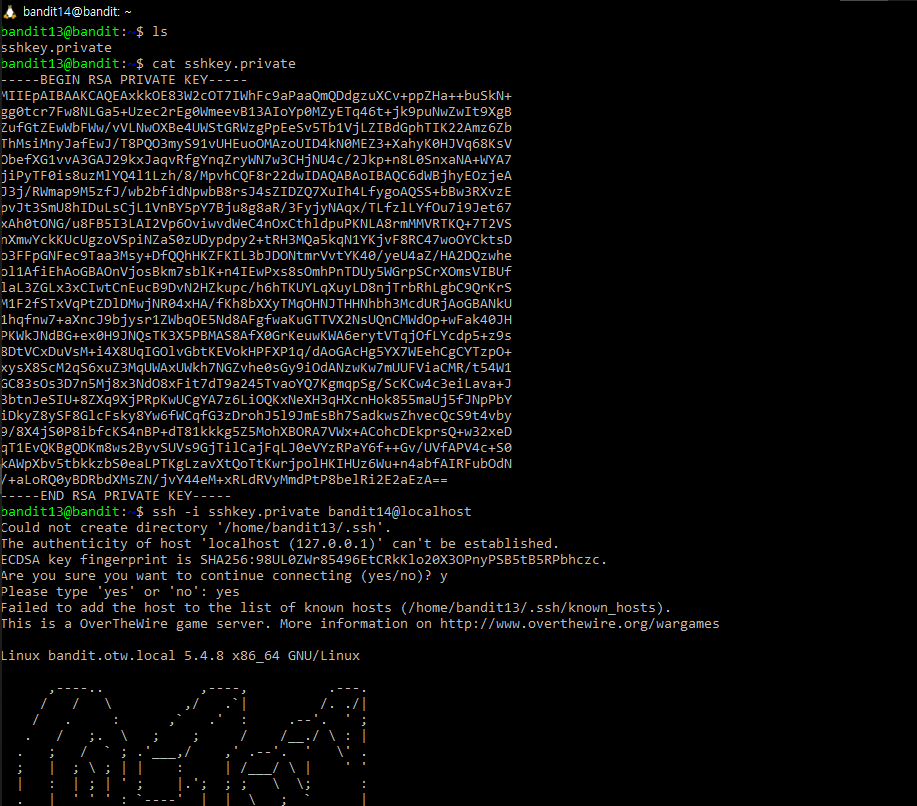

이번 문제는 SSH를 private키를 이용하여 접속하는 것이다. 기본 디렉터리에 sshkey.private라고 RSA 방식의 키가 있는데, 이를 통해서 bandit14으로 로그인하면 될 것이다. 물론 bandit13과 bandit14는 같은 기기 위에서 돌아가고 있으니 localhost를 사용하면 될 것이고.

SSH의 플래그를 찾느라 조금 고생했다. 저 키를 어떻게 쓰는 것인지 처음에 많이 헤메었다.

##### 15) Level 14~15

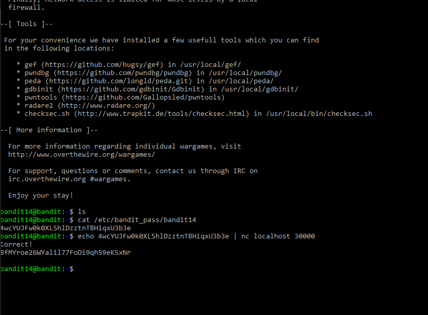

localhost로 비밀번호를 전송하라고 하는데, localhost의 어디로 비밀번호를 전송하라는 것일까. 아무것도 알 수가 없으니 이번에도 할 수 없이 다른 사람의 Write-up을 볼 수 밖에 없었다. nc를 이용하는데, echo를 pip와 연계하여 이렇게 사용할 수도 있구나 - 라는 생각이 들어 상당히 신기하였다.

nc (netcat)은 Network Connection에 관한 상당히 강력한 기능을 제공하고 있다는 사실을 검색을 통해 알게 되었다. 아마 다양한 곳에 응용이 가능할 것이라 생각이 든다. 포트를 열고 터미널에서 터미널로 문자열을 전송하는 예제를 보았는데, 기본적인 통신이 커널 단위에서 이렇게 간단하게 이루어지는 것이 상당히 신기하게 다가왔는데, 그 이유는 예전에 C++을 이용한 간단한 채팅 프로그램을 구현하고자 하였을 때 윈도우소켓을 사용해야했는데, 그 과정이 정말로 지루하고 복잡하였기 때문이다.

#### 후기)

정말로, 정말로 힘들었다. 리눅스는 처음이어서 모르는 명령어가 많음은 물론이고, 리눅스의 시스템 체계도 네트워크관리사 2급을 준비할 때 수박 겉핥기 식으로 대충 공부한 것이 전부라 모르는 부분이 상당히 많았기 때문이다.

이번 Bandit을 계기로 리눅스의 CLI와 친해지는 계기가 된 것 같았다. 해킹팀에 처음 들어와서 이 주소를 받았을 때, 그 때는 SSH도 연결할 줄 몰라서 얼마 못가 때려치웠는데, 지금와서 보니 상당히 아쉽다는 생각이 든다.

------

